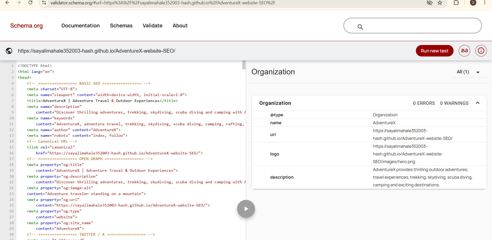

# AdventureX – SEO Optimized Travel Website

AdventureX is a responsive adventure travel landing page optimized for
on-page SEO, social media sharing, structured data, crawling, and indexing.

## 🌐 Live Demo

https://sayalimahale352003-hash.github.io/AdventureX-website-SEO/

## ✨ SEO Features

- SEO-friendly title and meta description
- Open Graph metadata
- Twitter/X metadata
- Schema.org JSON-LD structured data
- XML sitemap
- robots.txt
- Canonical URL
- Proper H1, H2, and H3 heading hierarchy
- Descriptive image alt attributes
- Responsive design

## 🛠️ Technologies

- HTML5
- CSS3
- JavaScript
- Schema.org JSON-LD
- GitHub Pages

## 🔍 Validation

- Schema.org Organization: **0 Errors, 0 Warnings**
  
- Open Graph metadata tested with Facebook Sharing Debugger
- Sitemap and robots.txt publicly accessible

## 📄 SEO Files

- [Sitemap.xml](https://sayalimahale352003-hash.github.io/AdventureX-website-SEO/sitemap.xml)
- [Robots.txt](https://sayalimahale352003-hash.github.io/AdventureX-website-SEO/robots.txt)

## 👩‍💻 Internship Project

**Internship:** Valentius Kryptix

## 📄 License

This project was created for educational and internship purposes.
